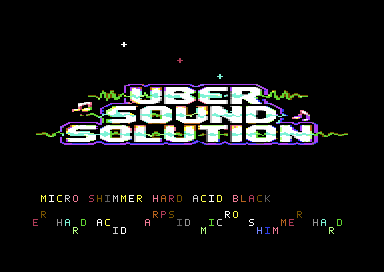

# C64 - Uber Sound Solution

An ArpSID-driven, no-intro hard-acid C64/ACME demo with bitmap eyecandy and
three-SID-style music data.



The production build pairs a compact bitmap intro with a 60-pattern acid
sequence, stable top-line text, beat-reactive colour work, and a black-border
presentation. The included checks run source, asset, branch-range, and ACME
syntax validation before assembly.

## Build

```sh
make
```

Expected output:

```text
build/uber_sound_solution.prg
```

The default target runs the source, asset, branch-range, and syntax audits
before assembling the PRG. `./make.sh` remains available as an equivalent
portable build entry point. Run the result in
[VICE](https://vice-emu.sourceforge.io/) with:

```sh
x64sc -autostartprgmode 1 -autostart build/uber_sound_solution.prg
```

The embedded BASIC loader starts it with `SYS 4096`.

## Final state

- starts at SLOT 4 TECHNOA
- no intro
- extra peak repeat SLOT 10..15
- all H_order entries use acid filter flag `$02`
- BERLIN fullbar patterns retained: 60
- pointer entries: 61
- asset_end: `$9f62`
- margin to `$a000`: 158 bytes


## Instrument/filter fix

- improved bass ADSR/PWM
- improved kick/hat/clap/big hit
- wider AcidLfo
- filter routes V1+V2+V3
- LP+BP acid filter retained

## Live VICE capture


