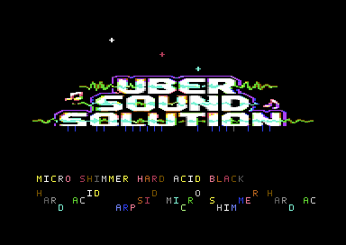
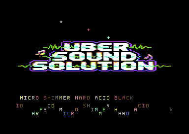

# C64 Uber Sound Solution

[](https://github.com/djayuffe/C64-Uber-Sound-Solution/actions/workflows/ci.yml)
[](LICENSE)

A PAL-timed Commodore 64 demo that combines a multicolour bitmap presentation,
a split-raster sine scroller, animated star sprites, and a three-voice SID acid
music engine. The source is written in 6502 assembly and builds with ACME.

Copyright (C) 2026 Ulf Bertilsson. Licensed under the
[GNU General Public License v3.0 only](LICENSE); see [NOTICE](NOTICE).

## Live VICE captures

Every image below is an unedited VICE framebuffer from the assembled PRG. The
demo changes on every music tick, so the frames show separate moments in one
continuous run rather than static artwork or mockups.

### Main bitmap and scroller scene


The bitmap logo, upper sprite field, black border, and lower sine scroller are
all active at once.

### Later music and scroller phase



This capture shows the later colour and scroller position reached after the
SID pattern player has continued through the sequence.

### Alternate sprite and scroller state



The beat-driven sprite positions and lower message continue to evolve while
the bitmap stays in its black-border presentation.

## Features

- **Bitmap top section:** uploads an 8,000-byte bitmap, screen, colour, and
  custom character set into the C64 memory layout at startup.
- **Two-stage raster IRQ:** a top interrupt selects the bitmap presentation;
  a split at raster line 200 switches to the bottom text/scroller area.
- **Black-border visual discipline:** beat reactions alter bitmap and sprite
  colours while retaining a black border and background.
- **Animated sprite field:** four hardware sprites use beat-driven position,
  colour, and X/Y expansion changes.
- **Three-voice SID player:** bass pulse, acid lead/arp, and noise percussion
  share an LP/BP filter with a step-driven cutoff LFO.
- **Fine scroller:** a repeating 32-character message moves across the lower
  screen with a beat-aware sine lift.
- **Data integrity:** source checks validate branch spans, label uniqueness,
  table sizes, and asset layout before the strict ACME build.

## Quick start

Download `uber_sound_solution.prg` from the latest release, then run it in a
PAL-capable C64 emulator or on suitable hardware. With VICE:

```sh
x64sc -autostartprgmode 1 -autostart uber_sound_solution.prg
```

The PRG has a BASIC loader that starts `SYS 4096` automatically. It runs until
the machine is reset. The demo targets PAL timing and is tuned for a MOS 8580-
style SID; NTSC and alternate SID revisions are not currently validated.

## Build from source

Requirements:

- ACME 0.97 or newer;
- Python 3;
- VICE `x64sc` or `x64` to run the demo.

```sh
git clone https://github.com/djayuffe/C64-Uber-Sound-Solution.git
cd C64-Uber-Sound-Solution
make
./vice_run.sh build/uber_sound_solution.prg
```

`make` runs the static checks first, then uses ACME `--strict-segments` to
produce `build/uber_sound_solution.prg`. `./make.sh` is a small wrapper around
the same Makefile for environments that prefer a shell entry point.

## Architecture

| Area | Details |
| --- | --- |
| Entry | BASIC `10 SYS4096` transfers control to `Start` at `$1000`. |
| Video | Bank 0; bitmap at `$2000`, bitmap screen at `$0400`, text charset at `$0800`. |
| IRQs | `IrqTop` drives the bitmap/SID/effects work; `IrqSplit` selects text mode and advances the scroller. |
| Assets | Four release assets load from `$6000`; source guards against growth into `$a000`. |
| Audio | SID voices 1–3 supply bass, lead, and percussion through the shared filter. |

The full routine, asset, and release-maintenance discussion is in
[docs/DEVELOPMENT.md](docs/DEVELOPMENT.md). The current source and cleanup
audit is recorded in [AUDIT.md](AUDIT.md).

## Verify and release

```sh
make clean
make
shasum -a 256 -c SHA256SUMS.txt
```

`SHA256SUMS.txt` covers every tracked release file except itself. GitHub Actions
runs the same clean build, shell-script validation, and checksum verification
for pull requests, pushes, version tags, and published releases; successful
workflows retain the PRG as a downloadable artifact.

## Repository layout

- `src/uber_intro.asm` — the single authoritative 6502 source file.
- `assets/` — bitmap, screen, colour, charset, and three direct VICE frames.
- `source_music/` — human-readable source material for the composition.
- `tools/` — focused static integrity checks used by `make verify`.
- `docs/DEVELOPMENT.md` — build, runtime contract, CI, and release guide.
- `CHANGELOG.md` — versioned release notes.
- `LICENSE` and `NOTICE` — GPLv3 terms and Ulf Bertilsson attribution.

## License

All original code, documentation, and bundled runtime assets are Copyright
(C) 2026 Ulf Bertilsson and released under GPL-3.0-only. You may copy, modify,
and redistribute the project under GPLv3; derivatives must retain the required
license notices. The project is provided without warranty.
